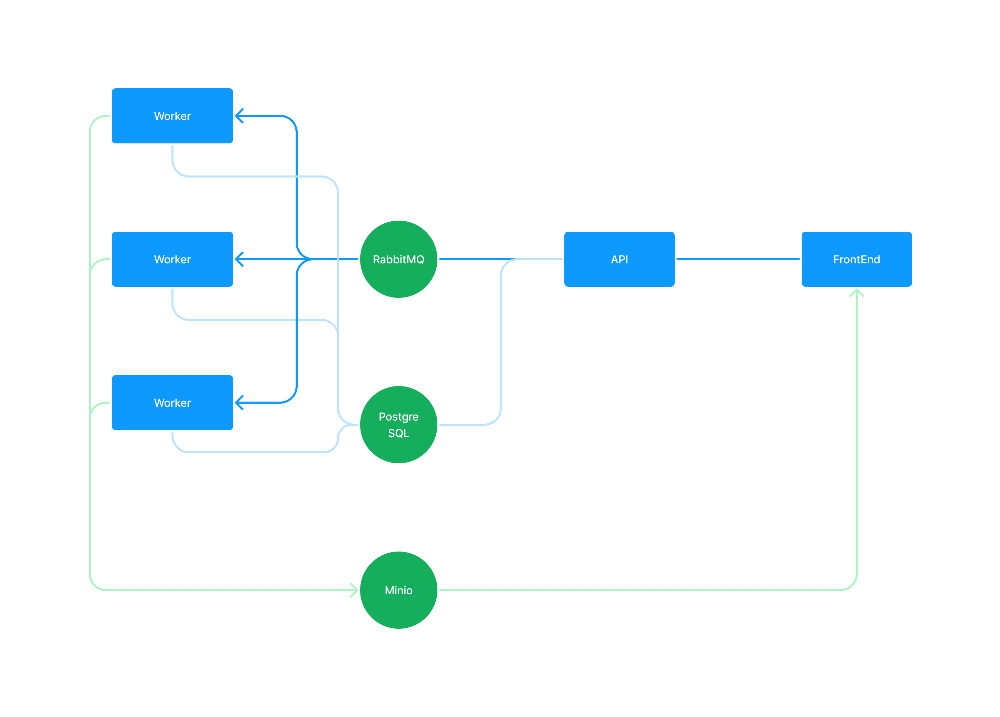

# image-blurring

## Overview



## Setup

```
python -m venv # Create virtual env
. .venv/bin/activate # Activate the virtual env
pip install -r requirements.txt
docker compose up -d # To launch postgresql, minio, rabbitmq
pip install --editable .
run-worker &
flask --app ./back/api/api.py run
# Open another terminal and run front end
cd front/app
npm install
npm run dev -- --open
```

## Next Steps

- Use subscriptions to improve update behavior on frontend
- Improve error handling
- Add tests
- Add pagination
- Deploy inside a kubernetes cluster with autoscaling for the workers pools
- Add replicate for RabbitMq and s3 (minio) to prevent data loss in case of crash and garantee high availability
